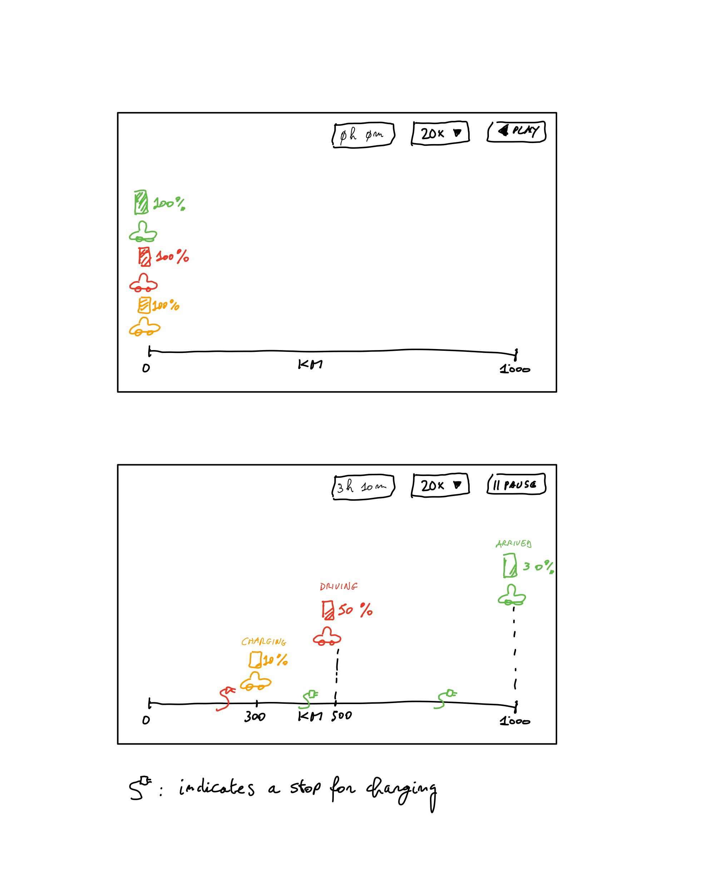

# ev-travel-visual-comparator

A web application to compare visually the travel times of electric vehicles (EVs) in a 1000 km travel scenario

## Features

The user must be able to see via the UI what the travel times and costs are for an EV on a 1000 km journey.

**NOTE**: This is a project in development, so the features are not yet fully implemented.

## UI

This is a prototype of the UI:

The UI shows:

- 3 EVs
- a 1000 km route
- when a vehicle is driving, charging, or is arrived at the destination
- different colors for each vehicle
- the passing of time
- the movement of cars towards their destination with a certain speed multiplier (in the image it is 20x, but the default is 60x)
- play and pause buttons to control the simulation
- a dropdown button to control the speed of the simulation
- indicators of how long a car has been stopped to recharge, how much it cost and where it stopped to recharge (there is a charging plug symbol to indicate where it stopped to recharge)
- 2 cells where insert the cost of the electricity per kWh:
  - one for the first leg of the journey (home charging)
  - one for the next legs of the journey (public charging)

## Cars behavior

- The cars start at the same time and travel towards the destination
- The cars start with a full battery
- The cars travel at a constant speed until they reach the destination or need to recharge
- The cars stop to recharge immediatly (not real but this is a simulation) when their battery is at 10%
- The cars recharge for exactly 15 minutes